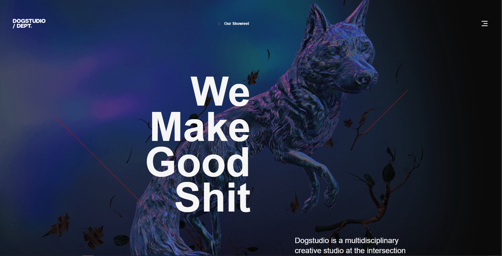

## Dogstudio – Creative Studio Experience (Next.js Clone)

[](https://dogstudio-c.vercel.app/)

<p align="left">
  <a href="https://dogstudio-c.vercel.app/" target="_blank">
    
  </a>
</p>

This is a modern recreation of the **Dogstudio** experience – a multidisciplinary creative studio at the intersection of art, design, and technology – built with **Next.js**, **React**, and rich motion/3D effects.  
The live production demo is hosted at [`https://dogstudio-c.vercel.app/`](https://dogstudio-c.vercel.app/).

### Features

- **Immersive landing experience** inspired by the original Dogstudio website  
- **Smooth GSAP animations** and scroll-based motion
- **3D visuals** powered by `three` and `@react-three/fiber`
- **Responsive layout** suitable for desktop and mobile

---

### Tech Stack

- **Framework**: Next.js 16, React 19
- **Language**: TypeScript
- **Styling**: Tailwind CSS 4
- **3D & WebGL**: three, @react-three/fiber, @react-three/drei
- **Animations**: GSAP, @gsap/react
- **Icons**: Remix Icon
- **Tooling**: ESLint (with `eslint-config-next`, `eslint-config-prettier`, `eslint-plugin-prettier`), Prettier

---

### Getting Started

- **Install dependencies**:

```bash
npm install
```

- **Run the development server**:

```bash
npm run dev
```

Open `http://localhost:3000` in your browser to view the app.

---

### Available Scripts

- **`npm run dev`**: Starts the development server
- **`npm run build`**: Builds the production bundle
- **`npm run start`**: Runs the production build
- **`npm run lint`**: Runs ESLint
- **`npm run lint:fix`**: Runs ESLint with auto-fix
- **`npm run format`**: Formats the codebase with Prettier
- **`npm run format:check`**: Checks formatting with Prettier
